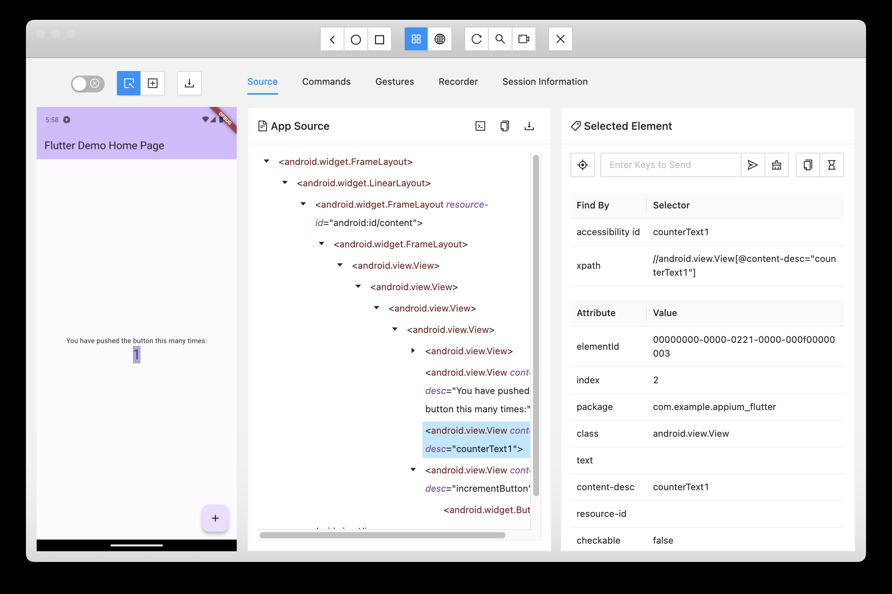
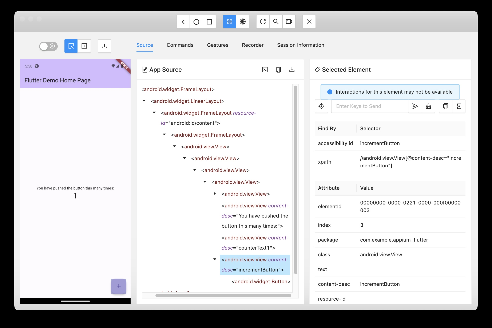

# E2E automation testing with Appium for Flutter project
## Initial packet
```shell
npm init
```
## Install Appium
```shell
npm i --save-dev appium
```
## Install the UiAutomator2 Driver
```shell
./node_modules/.bin/appium driver install uiautomator2
```
## Install webdriverio an Appium-compatible client library
```shell
npm i --save-dev webdriverio
```
## Flutter `main.dart`
Some Flutter widgets already have `semanticsLabel`, so just need to set the value of it. For instance `Text`
```dart
            Text(
              '$_counter',
              semanticsLabel: 'counterText$_counter',
              style: Theme.of(context).textTheme.headlineMedium,
            ),
```
Some others do not have it, so need to wrap it with `Semantics` widget:
```dart
       floatingActionButton: Semantics(
         label: 'incrementButton',
         child: FloatingActionButton(
           onPressed: _incrementCounter,
           tooltip: 'Increment',
           child: const Icon(Icons.add),
         ),
       ),
```
## Appium Inspector
From Appium Inspector, the widget would have `accessibility id`




## Sample Appium code
So we could use the `accessibility id` on the code as per sample on `test.js`
```javascript
async function runTest() {
    const driver = await remote(wdOpts);
    // Check the text counter is '0'
    const text0 = await driver.$('~counterText0');
    await text0.isDisplayed();
    // click on increment button
    const button = await driver.$('~incrementButton');
    await button.click();
    // wait for text counter was changed from '0'
    await text0.waitForExist({reverse: true})
    const text1 = await driver.$('~counterText1');
    await text1.isDisplayed();
}
```