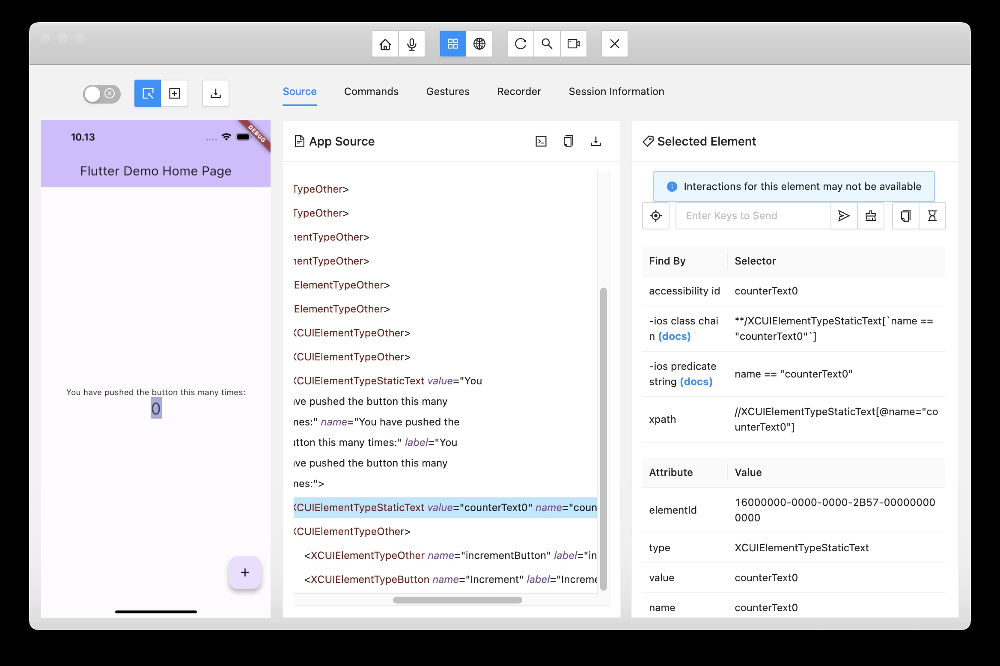
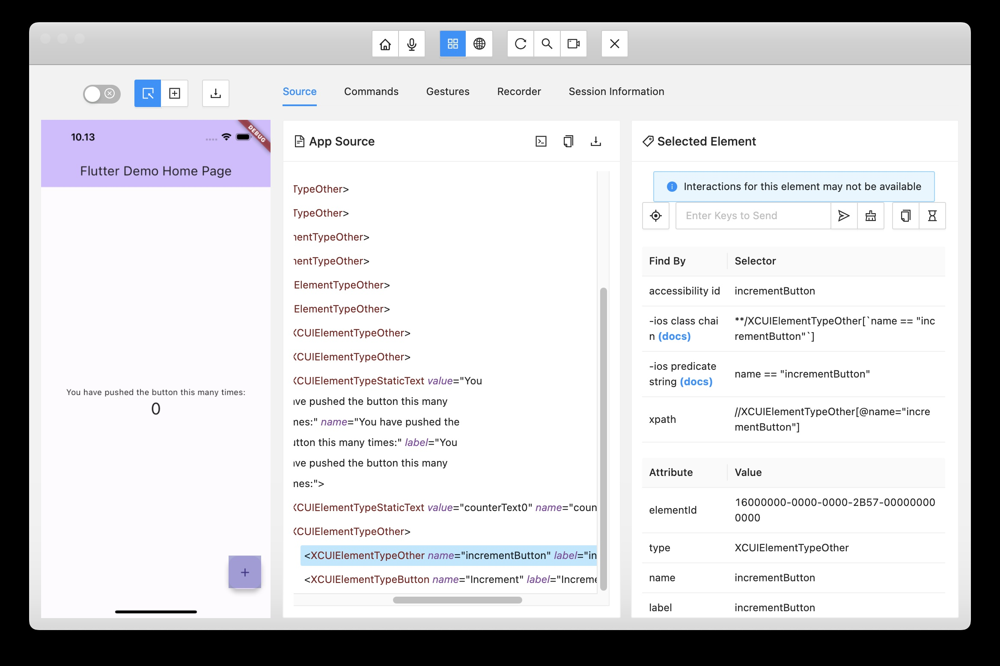

# E2E automation testing with Appium for Flutter project
## Initial packet
```shell
npm init
```
## Install Appium
```shell
npm i --save-dev appium
```
## Install the UiAutomator2 Driver for Android
```shell
./node_modules/.bin/appium driver install uiautomator2
```
## Install the XCUITest Driver for iOS
```shell
./node_modules/.bin/appium driver install xcuitest
```
## Install webdriverio an Appium-compatible client library
```shell
npm i --save-dev webdriverio
```
## Flutter `main.dart`
Some Flutter widgets already have `semanticsLabel`, so just need to set the value of it. For instance `Text`
```dart
            Text(
              '$_counter',
              semanticsLabel: 'counterText$_counter',
              style: Theme.of(context).textTheme.headlineMedium,
            ),
```
Some others do not have it, so need to wrap it with `Semantics` widget:
```dart
       floatingActionButton: Semantics(
         label: 'incrementButton',
         child: FloatingActionButton(
           onPressed: _incrementCounter,
           tooltip: 'Increment',
           child: const Icon(Icons.add),
         ),
       ),
```
## Appium Inspector
From Appium Inspector, the widgets would have `accessibility id`
### from Android emulator


### from iOS simulator



## Sample Appium code
So we could use the `accessibility id` on the code as per sample on `test.js`
```javascript
async function runTest() {
    const driver = await remote(wdOpts);
    // Check the text counter is '0'
    const text0 = await driver.$('~counterText0');
    await text0.isDisplayed();
    // click on increment button
    const button = await driver.$('~incrementButton');
    await button.click();
    // wait for text counter was changed from '0'
    await text0.waitForExist({reverse: true})
    const text1 = await driver.$('~counterText1');
    await text1.isDisplayed();
}
```
# How to run
## Run the following command on terminal to run Appium server
```shell
npm run appium
```
## Open new terminal, then run the following command to run the test script:
### For Android
note: make sure your Android emulator is already running, and the flutter application already installed on Android emulator
```shell
npm run android
```
### For iOS
note: make sure your iOS simulator is already running, and the flutter application already installed on iOS simulator
```shell
npm run iOS
```